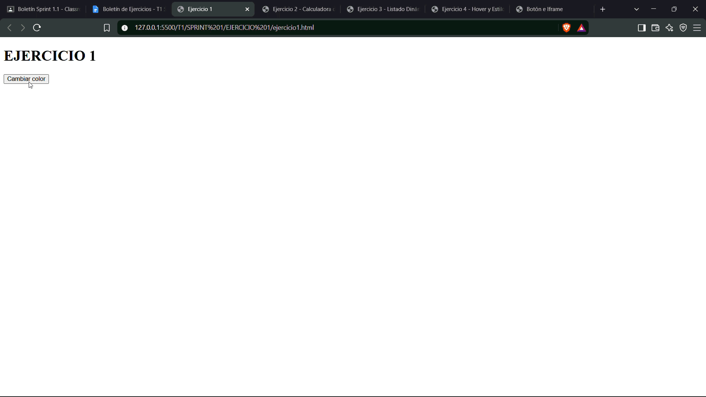
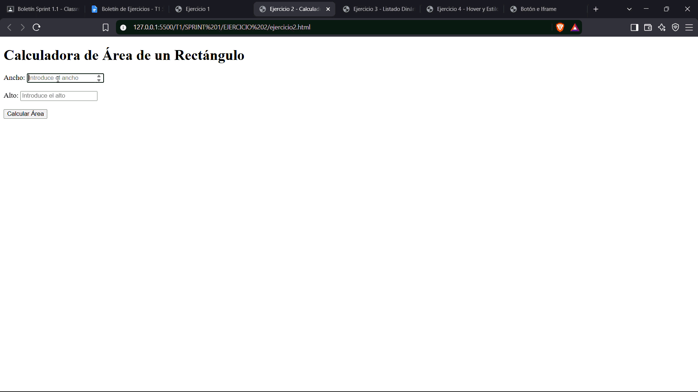
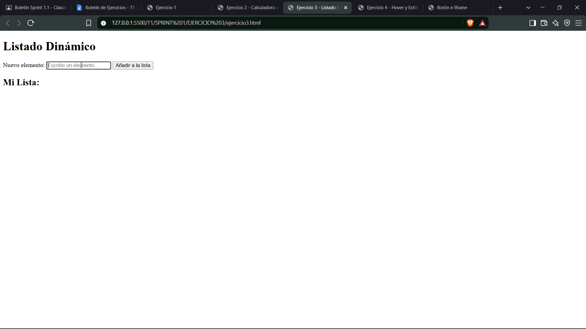
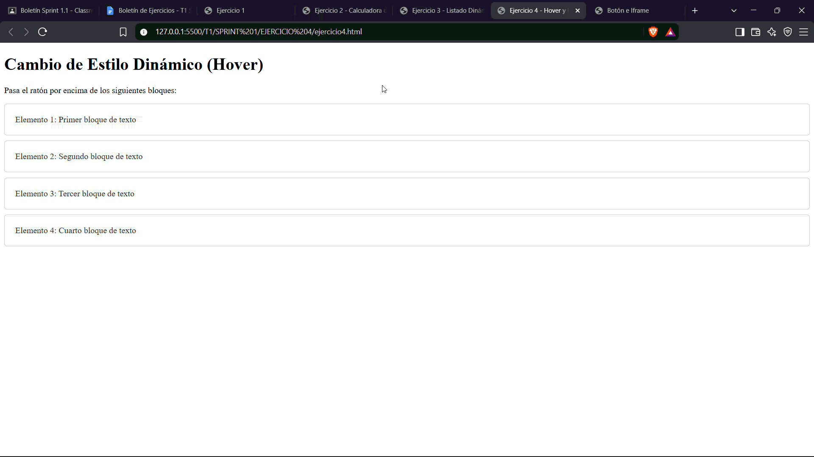
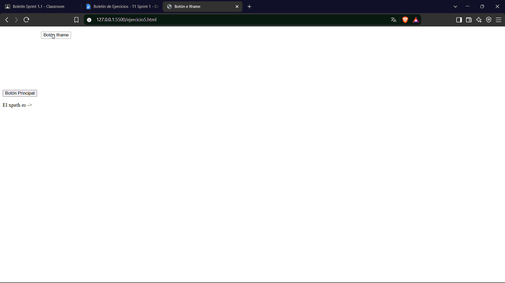

# Boletín de Ejercicios - Sprint 1
**Asignatura:** Desarrollo Web en Entorno Cliente  
**Estructura de entrega:** `Sprint 1 / MEDIA /`

---

## 📋 Descripción General
Resolución de los 5 ejercicios prácticos correspondientes al Sprint 1 para afianzar la interacción con el DOM, el manejo de eventos en JavaScript y la manipulación de elementos HTML.

---

## 🏋️‍♂️ Ejercicio 1: Cambio de Color con Botón

* **Análisis del problema:** Crear un botón que al pulsarse cambie aleatoriamente el color de fondo de la página web utilizando valores RGB.
* **Diseño:** Un documento HTML con una estructura limpia y un botón que desencadena un evento `click` conectado a una función en JavaScript que genera valores numéricos aleatorios entre 0 y 255 mediante `Math.random()`.
* **Archivos entregados:** `ejercicio1.html`, `ejercicio1.js`

### 🎥 Prueba de Funcionamiento

---

## 🧮 Ejercicio 2: Calculadora de Área

* **Análisis del problema:** Crear una página interactiva con dos inputs para ingresar alto y ancho de un rectángulo, calculando su área al pulsar un botón.
* **Diseño:** Un formulario con dos campos numéricos (`<input type="number">`), un botón de acción y un párrafo (`
`) donde se insertará el resultado del cálculo ($ancho \times alto$).
* **Archivos entregados:** `ejercicio2.html`, `ejercicio2.js`

### 🎥 Prueba de Funcionamiento

---

## 📝 Ejercicio 3: Listado Dinámico

* **Análisis del problema:** Insertar nuevos ítems dentro de una lista no ordenada (`<ul>`) a partir del texto ingresado por el usuario en un campo de texto.
* **Diseño:** Capturar la entrada del usuario, instanciar un nuevo elemento de lista utilizando `document.createElement('li')` y añadirlo dinámicamente a la lista contenedora usando `.appendChild()`.
* **Archivos entregados:** `ejercicio3.html`, `ejercicio3.js`

### 🎥 Prueba de Funcionamiento

---

## 🎨 Ejercicio 4: Hover y Estilo Dinámico

* **Análisis del problema:** Aplicar cambios visuales dinámicos a bloques `
` al pasar el cursor sobre ellos (hover) y restaurar sus estilos al retirar el ratón.
* **Diseño:** Vinculación de los eventos de escucha `mouseover` y `mouseout` en JavaScript a múltiples elementos `
` seleccionados en el DOM.
* **Archivos entregados:** `ejercicio4.html`, `ejercicio4.js`

### 🎥 Prueba de Funcionamiento

---

## 🎯 Ejercicio 5: Detección de Clics y Generación de XPath

* **Análisis del problema:** Detectar cualquier clic dentro del documento (incluyendo elementos contenidos en un `<iframe>`) y calcular dinámicamente su XPath relativo/absoluto para mostrarlo en pantalla y mediante una alerta.
* **Diseño:** Asignación de un evento global de escucha `click` en el documento y dentro del marco del `iframe`. Uso de recursividad para calcular el índice e itinerario de las etiquetas hijas desde su contenedor raíz o ID.
* **Archivos entregados:** `ejercicio5.js` *(utilizando el HTML base proporcionado)*

### 🎥 Prueba de Funcionamiento
